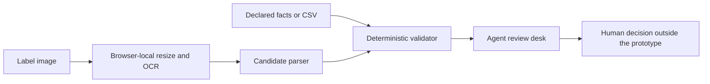

# Proofline

> A browser-first evidence-review prototype for U.S. distilled-spirit labels. It turns declared label facts and a label image into a conservative, agent-led review—not an automatic approval.

**Live prototype:** `PENDING_STATIC_DEPLOYMENT_URL` — this is deliberately a placeholder, not a live URL. Replace it only after the verified `dist/` bundle is published.

## What it does

Proofline gives a reviewer one place to compare an application against a label image:

- accepts a single label or a batch of JPEG, PNG, and WebP images (up to 10 MB each);
- performs English OCR locally in the browser, parses candidate facts, and keeps the raw OCR evidence visible;
- compares brand, class/type, ABV, optional proof, net contents, producer address, imported-product origin, and the federal government warning against the supplied application;
- shows a reviewable field-by-field outcome with source, confidence, and correction controls; and
- preserves the original OCR after a correction and labels the revised candidate **Agent-entered**.

The prototype deliberately never calls a result “approved.” A clean comparison reads: **“No discrepancies detected — agent approval required.”**

## Quick start

Prerequisite: Node.js 20+ and pnpm 9+.

```bash
pnpm install
pnpm dev
```

Open the local URL printed by Vite (normally `http://localhost:5173`). The OCR worker and English language data are included in `public/ocr`, so normal use does not need an OCR API key or a remote CDN.

Create and inspect the production bundle with:

```bash
pnpm build
pnpm preview
```

If OCR assets ever need to be refreshed after a dependency update, run `pnpm sync:ocr-assets` and commit the resulting files under `public/ocr/` so production remains self-contained.

## Guided demo

1. Start the app and select **Open guided demo** on the overview screen.
2. Review the seeded Old Tom Bourbon evidence. It is an illustrative fixture, clearly disclosed in the interface—not a live OCR or regulatory decision.
3. Expand **View complete extracted text** to see the raw evidence, then inspect the field comparison.
4. Use a correction control only when the visible image supports it; the replacement becomes **Agent-entered** while the original raw OCR remains displayed.
5. Complete the required visual typography confirmation after checking that the warning heading is uppercase and bold.

For a real label, choose **New review**, supply the declared application facts, attach one supported image, and begin an evidence review.

## Batch CSV

Batch review accepts up to **300 selected images** and processes them through no more than **two OCR workers** at a time. The optional CSV matches selected files by trimmed, case-insensitive basename. It does not upload the images.

Download the safe starter file: [public/batch-template.csv](public/batch-template.csv).

The included row is a schema illustration. Replace `old-tom-bourbon.svg` with the basename of a selected JPEG, PNG, or WebP before import; the guided-demo SVG is not an accepted production intake file.

```csv
filename,brandName,classType,abv,proof,netContents,producerAddress,isImported,countryOfOrigin
old-tom-bourbon.svg,OLD TOM DISTILLERY,Kentucky Straight Bourbon Whiskey,45%,90,750 mL,"Old Tom Distillery, Louisville, KY",false,
```

CSV behavior is intentionally strict:

- `filename` alone is valid for OCR triage; those items are marked **Application data required** rather than compared.
- If any application-data column is present, the complete application schema is required: `brandName`, `classType`, `abv`, `netContents`, `producerAddress`, and `isImported`. `proof` and `countryOfOrigin` remain conditional/optional as appropriate.
- `isImported` must be `true` or `false`; imported rows require `countryOfOrigin`.
- ABV, proof, and net contents must parse as supported numeric formats. A malformed or partial CSV is rejected rather than silently downgraded.
- Duplicate selected filenames or duplicate CSV rows are flagged because a safe one-to-one match cannot be inferred. Selected files without a CSV row stay in OCR triage.

## Architecture



This is a static React + TypeScript + Vite application. There is no application server.

- **Evidence extraction:** `tesseract.js` loads its worker, WASM core, and English training data from same-origin files in `public/ocr/`. Images longer than 2,000 pixels are resized before OCR. The extraction path uses a global maximum of two active workers and times out failed worker initialization.
- **Evidence model:** each parsed candidate carries the value, raw OCR text, confidence, and source. A reviewer correction changes only the candidate value/source; raw OCR is retained.
- **Validation engine:** a pure, tested TypeScript module makes conservative comparisons. The UI consumes its field results rather than embedding compliance logic in components.
- **Batch intake:** a strict CSV parser pairs CSV rows to selected image basenames, while a cancellation-aware queue owns the batch lifecycle and avoids stale worker results after a batch is cleared.
- **Review experience:** accessible controls expose evidence, field-level reasons, status precedence, correction workflows, retry states, and a manual typography confirmation.

## Validation behavior

Proofline is intentionally conservative. It compares only the facts supplied to this prototype and treats confidence as a review signal, not proof of compliance.

| Extraction confidence | Field outcome |
| --- | --- |
| `>= 0.85` | Eligible for a deterministic match or mismatch outcome |
| `0.60–0.84` | Needs review, even when the text appears equivalent |
| `< 0.60` or absent | Unreadable |

Overall status follows this precedence: **Mismatch → Unreadable → Needs review → Match**. A lower-priority clean field never hides a stronger discrepancy or missing-evidence state.

The federal warning is handled specially:

- the body is compared with the exact canonical statement after whitespace normalization;
- the heading must be the literal uppercase `GOVERNMENT WARNING:`;
- OCR cannot establish layout, capitalization rendering, or bold weight reliably, so **visual typography confirmation** is always an explicit agent task; and
- a typography-confirmed warning is still not an approval; the reviewer owns the final decision.

Canonical source links:

- [27 CFR Part 16 — Alcoholic Beverage Health Warning Statement](https://www.ecfr.gov/current/title-27/chapter-I/subchapter-A/part-16)
- [27 CFR § 16.21 — Mandatory label information](https://www.ecfr.gov/current/title-27/chapter-I/subchapter-A/part-16/subpart-C/section-16.21)
- [27 CFR § 16.22 — Legibility, capitalization, bold type, and sizing requirements](https://www.ecfr.gov/current/title-27/chapter-I/subchapter-A/part-16/subpart-C/section-16.22)

Those links are the authority for the exact warning text and its presentation requirements. Proofline is a technical evidence aid and not legal advice, a regulatory determination, or a substitute for agency review.

## Privacy

Proofline is browser-first by design:

- label files, OCR text, corrections, and comparison results live only in the current browser session;
- the application has no backend, database, API key, analytics package, telemetry call, or external runtime OCR CDN;
- selecting a label creates browser-local object URLs for preview; clearing a batch and leaving the page releases the application-held state; and
- a static host serves the app bundle and local OCR assets, but the client code does not upload label images or application facts.

For a production deployment, review the hosting provider’s own request logging, CDN caching, and analytics settings separately. Those infrastructure controls are outside this prototype and should be disabled or configured to match the organization’s data-retention policy.

## Limitations

- **Scope:** U.S. distilled-spirit labels only. Beer, wine, ready-to-drink products, non-U.S. regimes, and broader advertising claims are out of scope.
- **Evidence:** JPEG, PNG, and WebP only; PDFs, HEIC, and camera-live capture are not supported. Each file is capped at 10 MB and a selection is capped at 300 files.
- **Physical-label checks:** OCR cannot prove printed type size, contrast, bold styling, package curvature, label attachment, or other physical-label requirements. An agent must verify the visual warning typography and any physical characteristics.
- **OCR:** English OCR may misread stylized, curved, low-resolution, obstructed, or multilingual labels. Low-confidence and missing values remain review work, not silent defaults.
- **Workflow:** there is no authentication, persistence, audit trail, role management, or automatic approval. A human reviewer must make any final compliance or COLA-related decision.

## Testing

Run the complete automated suite and production build locally:

```bash
pnpm test:run
pnpm lint
pnpm build
```

The suite covers deterministic validation and warning behavior, parser extraction, local OCR worker failure handling, CSV schemas and matching, queue cancellation/retry lifecycle, export safety, UI review states, and this README/template contract. `pnpm build` type-checks the application and emits the deployable static bundle in `dist/`.

## Deployment

**Deployment status:** build verified locally; no public URL is claimed in this repository until a static host publishes `dist/`.

For any static host (including a Sites project), use:

```bash
pnpm install --frozen-lockfile
pnpm build
```

Configure the host with:

- **Build command:** `pnpm build`
- **Publish directory:** `dist`
- **Runtime requirement:** serve the `public/ocr/` assets copied into `dist/ocr/` from the same origin as the application; do not replace them with a third-party OCR CDN.

After publication, smoke-test a real label upload and the batch template from the deployed origin. Confirm that the network panel contains only static-app/OCR asset loads and no image or application-data upload. Then replace `PENDING_STATIC_DEPLOYMENT_URL` at the top of this README with the verified HTTPS URL.

## Future Azure path

The browser-only POC intentionally keeps the trust boundary small. A production Azure evolution should preserve the agent-led decision model rather than turning OCR confidence into automatic approval:

1. **Introduce an authenticated service boundary.** Keep browser inputs behind Microsoft Entra ID, Azure API Management, and a minimal Azure Functions or Container Apps API. Never place Azure keys or a COLA credential in the client bundle.
2. **Use private, short-lived evidence storage.** Upload explicit reviewer-approved files to a private Azure Blob Storage container through short-lived SAS or server-issued upload tokens. Encrypt at rest, define retention/deletion jobs, and separate raw evidence from reviewer corrections and audit events.
3. **Swap OCR behind a stable contract.** Preserve the current `LabelExtraction` candidate contract and route it to an approved Azure AI OCR service selected during implementation. Record model/version, extraction timestamps, confidence, and raw text for traceability; keep deterministic validation as a separately versioned service/module.
4. **Add audit-grade human workflow.** Persist application facts, raw evidence references, corrections, reviewer identity, decision reason, rule version, and immutable event history. Use role-based access, review queues, exception ownership, and monitored retry/dead-letter behavior.
5. **Integrate COLA only through authorized access.** Do not scrape or imply a public approval API. After obtaining TTB-approved data/API access and legal authorization, build a server-side adapter that maps an explicit COLA/application identifier to permitted read-only metadata, applies rate limits and audit logs, and presents any lookup as supporting evidence for a human reviewer—not a final compliance verdict.

That path preserves what is valuable in this prototype: transparent evidence, conservative deterministic checks, and a person accountable for the final call.
