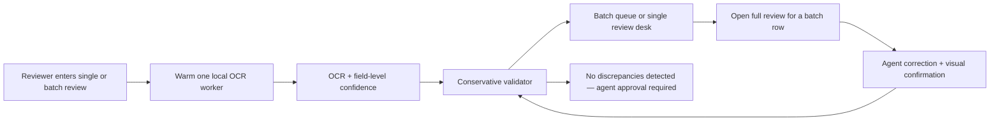

# Proofline evidence hardening design

**Status:** approved design, pending written-spec review  
**Date:** 2026-07-13

## Purpose

Strengthen the existing browser-local alcohol-label prototype against the gaps found in
the take-home audit without changing its trust boundary. The finished product remains a
U.S. distilled-spirit evidence aid: it never approves a label, never sends label data to
a backend, and keeps the agent responsible for a final decision.

This work has six outcomes:

1. Correctly surface explicit foreign-origin evidence when an application declares a
   product domestic.
2. Let a batch reviewer complete an individual label review without losing queue state.
3. Make OCR confidence field-specific and conservative.
4. Improve the five-second experience through intent-triggered warming, an honest slow
   path, and an on-device benchmark.
5. Make important exception paths demonstrable and parser behavior more realistic.
6. Publish the exact validated source revision that recruiters will review.

## Constraints and non-goals

- Keep OCR in the browser with the existing same-origin Tesseract assets. No cloud OCR,
  backend, authentication, persistence, COLA integration, analytics, or telemetry.
- Retain the current U.S. distilled-spirit proof-of-concept scope. Explicit beer, wine,
  cider, seltzer, malt, and ready-to-drink entries are blocked at intake; unknown
  distilled-spirit wording is not rejected solely because a small parser vocabulary does
  not recognize it.
- Preserve raw OCR text after every correction and label corrections as agent-entered.
- Do not promise a universal sub-five-second OCR result. Instead, make the real timing,
  delay recovery, and device-specific benchmark visible.
- Do not use invented image-generation text for regulatory examples. Guided fixtures
  must render the same evidence that their deterministic OCR fixture contains.

## Architecture

### OCR engine and confidence

Replace the single exported extraction function's hidden pool with an OCR-engine facade:

- `extract(file, onProgress)` remains the application extraction entry point.
- `prewarm()` initializes at most one idle worker after a reviewer intentionally enters
  a single or batch review. It is scheduled during idle time with a timer fallback; it
  never runs automatically on page load.
- The pool still has a hard maximum of two workers. The second worker remains
  demand-created for batch processing.

The engine asks Tesseract for text and block/line/word data, disables outputs that are
not consumed, and returns total plus phase timings (prepare, pool/worker wait,
recognition). A failed or timed-out initialization remains an unreadable extraction;
warming failures are silent until a reviewer actually submits a label.

`extractFromText` continues to accept a fixture confidence number. For live OCR it also
accepts a resolver built from word and line confidences. Each parsed candidate receives
the minimum confidence across its matched contiguous OCR words. If an exact word span is
not found, the matching line's minimum confidence is used; if neither mapping is safe,
the candidate is assigned below the readable threshold. This deliberately routes an
ambiguous field to review/unreadable rather than using a high page-wide confidence.

### Single-label slow path

When a real extraction exceeds five seconds, the processing view presents a plain
language delay notice with two choices:

- **Keep waiting** leaves OCR running normally.
- **Review manually now** switches to the existing evidence desk with the original label
  preview and empty OCR candidates. The reviewer can add human-verified candidates and
  complete visual checks without an approval claim.

The existing extraction-run token ignores any late OCR result after manual mode begins,
so an in-flight worker cannot overwrite a human-led review. It is not abandoned through
`Promise.race`, which would make pooling unreliable. At 15 seconds, a longer-delay
action offers an explicit user-initiated stop-and-manual-review path that discards the
active worker.

The overview also adds a progressively disclosed **Run local sample benchmark** action.
It fetches the shipped sample from the same origin, runs two sequential extractions on
the current device, and reports the first sample run and second warm-worker run with
timing, field coverage, and per-field confidence. A fresh browser profile is required
to observe an uninitialized worker, so the interface never labels a normal session run
as network-cold. It records nothing outside the browser session.

### Validation and manual visual checks

The validation engine changes domestic-origin behavior only when credible evidence is
present:

- a domestic application with a readable explicit `Product of`, `Made in`, or equivalent
  foreign-origin candidate becomes **Needs review** with a domestic/import-status reason;
- it is not a hard mismatch or legal determination;
- absent or unreadable origin evidence remains not-required for a domestic application;
- existing imported-product exact-match behavior remains unchanged.

The visual checklist gains a separate warning-legibility confirmation. It records that
the reviewer inspected legibility, contrast, and placement; it explicitly says that
printed type-size measurement still belongs to the final regulatory review. Typography
(uppercase/bold) and legibility are both visible, independent review tasks. Neither can
turn a result into an approval.

### Batch full review

Batch review remains a high-throughput queue, but a row with application data gains an
**Open full review** action. It renders the existing `ReviewDesk` inside the mounted
batch workspace rather than routing through `App`. This preserves filters, queue items,
in-progress work, object-URL cleanup, and the reviewer’s return point.

Each `QueueItem` retains its application facts and visual-confirmation flags alongside
its file, raw OCR, extraction, and result. The embedded desk receives an object URL made
from the retained original file. On a candidate correction or visual confirmation, the
same item is updated, `validateLabel` is rerun, and its returned batch status and export
reflect the revised result. The original raw OCR remains untouched.

Filename-only rows deliberately remain OCR triage. They cannot be represented as full
verification without declared application facts, so the UI keeps their **Application
data required** status rather than inventing data or rerunning OCR.

### Parser and guided scenarios

The producer/address parser becomes line-oriented. It recognizes `Bottled by`,
`Distilled by`, `Produced by`, `Imported by`, `Manufactured by`, and `Importer:`. It
captures the remainder of that line plus at most two address-like continuation lines and
stops before a blank line or another mandatory field. The candidate retains the original
multiline OCR fragment while its comparison value is whitespace-normalized.

The guided-demo entry becomes a compact scenario library with clear fixture disclosures:

1. clear Old Tom label;
2. application-versus-label mismatch using the existing real sample;
3. domestic declaration with explicit foreign-origin evidence;
4. title-cased warning heading; and
5. degraded/glare-like evidence that routes to review.

Where a scenario cannot truthfully reuse the real sample image, the app renders a
deterministic HTML/CSS label fixture from the exact same structured values used for its
raw evidence. The degraded scenario uses the real sample with a clearly disclosed visual
degradation treatment. No scenario represents fixture timing as live OCR timing.

## User-facing flow

## Error handling

- Unsupported/out-of-scope beverage terms fail before OCR with a clear scope message.
- Prewarm failure does not block intake; a submitted OCR failure remains a recoverable
  unreadable/error state with retry or manual-review recovery.
- Word/line confidence alignment failure never inherits page confidence.
- Batch full review remains unavailable for extraction-only rows, preventing a false
  verified state.
- Returning from a batch item restores the current queue and releases any review object
  URL.

## Testing and acceptance evidence

Add or update tests for:

- domestic/foreign-origin contradiction, imported exact match, and low-confidence origin;
- per-field confidence resolution, conservative fallbacks, prewarming, phase timings,
  and worker discard behavior;
- five-second manual-review transition and late-result protection;
- full-review handoff from a batch row, correction persistence, both visual checks,
  revalidation, return-to-batch behavior, and retained queue progress;
- line-wrapped and importer-address parsing without swallowing warning content;
- explicit out-of-scope beverage rejection;
- each guided scenario’s disclosed title, evidence, and expected outcome;
- README/package/CI pnpm-version alignment.

Validation before release includes the complete unit/UI suite, typecheck, production
build, local browser verification of the real sample and benchmark, an accessible batch
handoff check, and a post-deploy normal-browser smoke test. The Sites deployment must
use the exact validated and pushed commit, then be checked against the public URL so the
live recruiter path matches GitHub.

## Documentation changes

Update the README and design notes to describe the benchmark, field-level confidence,
manual slow path, full-review batch handoff, warning-legibility boundary, parser scope,
scenario fixtures, and the exact Node/Corepack/pnpm toolchain. Pin CI's pnpm setup to
the package-manager version declared in `package.json`.
